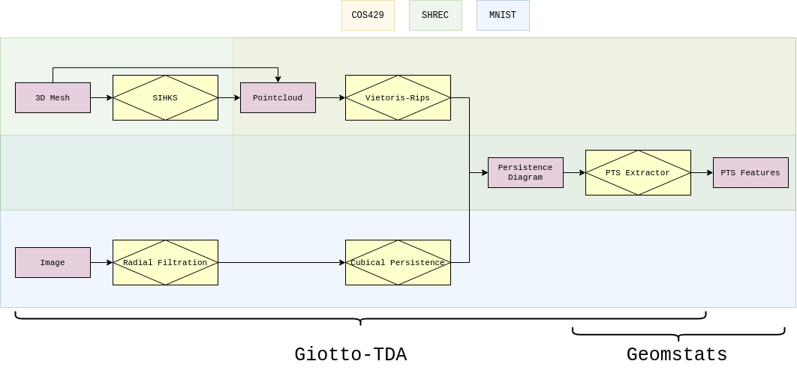

# ICLR Computational Geometry & Topology Challenge 2021

Welcome to the ICLR Computational Geometry & Topology challenge 2021!

## Results

The paper summarizing the results and findings of the challenge is out! You can find it [here on the webpage of the challenge](https://gt-rl.github.io/challenge.html).

All submissions to the challenge were of very high quality. We warmly congratulate all of the participants! We encourage the interested readers to take a look at the participants' submissions in the different folders of this repository.

The winners were decided using the [Condorcet Method](https://github.com/geomstats/challenge-iclr-2021/blob/main/README.md#evaluation-and-ranking).

Here are the best contributions to open-source computational geometry and topology of ICLR 2021! 

### Winner 1st place ($2000):

Matei Bejan, Bogdan Luchian, Andrei Manolache, Armand Nicolicioiu, Mihaela Nistor, Mihai Sorin Stupariu

[Topological noise invariant features using Giotto-TDA and Geomstats](https://github.com/geomstats/challenge-iclr-2021/blob/main/1st-prize__mihaelanistor__Noise-Invariant-Topological-Features/noise_invariant_topological_features.ipynb) 



### Co-winners for 2nd and 3rd place ($750 each):

- Saiteja Utpala: [Shrinkage Estimator of SPD matrices & Recursive Karcher Expectation Estimator](https://github.com/geomstats/challenge-iclr-2021/tree/main/2nd-prize__SaitejaUtpala__Estimators-of-Mean-of-SPD-Matrices)
- Elodie Maignant: [Visualization of Kendall shape spaces for triangles](https://github.com/geomstats/challenge-iclr-2021/blob/main/2nd-prize__emaignant__Visualization-of-Kendall-Shape-Spaces-for-Triangles/submission_visualization_of_kendall_shape_spaces_for_triangles.ipynb)

### Special mentions:

- Gabriele Corso: [Neural Sequence Distance Embeddings](https://github.com/geomstats/challenge-iclr-2021/blob/main/gcorso__Neural-Sequence-Distance-Embeddings/Neural_SEED.ipynb)
- Somesh Mohapatra: [Repurposing peptide inhibitors for SARS-Cov-2 spike protein](https://github.com/geomstats/challenge-iclr-2021/blob/main/SomeshMohapatra__Protein-Peptide-Interactions-with-TDA/Protein_Peptide_Interactions-TDA.ipynb)

Congratulations to all!!

The organizers will be in touch with the winners to distribute the prizes, and in touch with all the participants to write the white paper summarizing the findings of the challenge.

## Description of the challenge

The purpose of this challenge is to push forward the fields of computational differential geometry and topology, by creating the best data analysis, computational method, or numerical experiment relying on state-of-the-art geometric and topological Python packages.

All participants will have the opportunity to co-author a white paper summarizing the findings of the challenge.

Each submission takes the form of a Jupyter Notebook leveraging the packages [Geomstats](https://github.com/geomstats/geomstats) and [Giotto-tda](https://github.com/giotto-ai/giotto-tda). The participants submit their Jupyter Notebook via [Pull Requests](https://github.com/geomstats/challenge-iclr-2021/pulls) (PR) to this GitHub repository, see [Guidelines](#guidelines) below.

**Note:** _We invite participants to review this README regularly, as details are added to the guidelines when questions are submitted to the organizers._


## Deadline

The final Pull Request submission date and hour will have to take place before:
- **May 2nd, 2021 at 23:59 PST (Pacific Standard Time)**. 

The participants can freely commit to their Pull Request and modify their submission until this time.

## Winners announcement and prizes

The first 3 winners will be announced at the ICLR 2021 virtual workshop [Geometrical and Topological Representation Learning](https://gt-rl.github.io/) and advertised through the web. The winners will also be contacted directly via email. 

The prizes are:
- $2000 for the 1st place,
- $1000 for the 2nd place,
- $500 for the 3rd place.
 
## Subscription

Anyone can participate and participation is free. It is enough to:
- send a [Pull Request](https://github.com/geomstats/challenge-iclr-2021/pulls),
- follow the challenge [guidelines](#guidelines),
to be automatically considered amongst the participants. 

An acceptable PR automatically subscribes a participant to the challenge.

## Guidelines

We encourage the participants to start submitting their Pull Request early on. This allows to debug the tests and helps to address potential issues with the code.

Teams are accepted and there is no restriction on the number of team members.

The principal developpers of Geomstats and Giotto-tda (i.e. the co-authors of Geomstats/Giotto-tda published papers) are not allowed to participate.

A submission should respect the following Jupyter Notebook’s structure:
- Introduction and motivation: 
    - Explain and motivate the problem
- Analysis/Experiment:
    - Describe the dataset (if your submission analyzes on a dataset)
    - Detail and motivate the steps of the analysis/experiment
    - Describe and highlight the role of Geomstats and Giotto-tda
- Benchmark:
    - Compare your results with other methods/packages
- Limitations and perspectives:
    - Describe the limitations of your analysis/method/experiment
    - Describe the limitations of the packages Geomstats and Giotto-tda
    - List features that you would like to find in packages like Geomstats and Giotto-tda

Here is a non-exhaustive list of possible submissions:
- Data analysis with geometric and topological methods,
- Implementation of the code from a research paper with Geomstats and Giotto-tda
- Implementation of a feature to merge into Geomstats and Giotto-tda codebases (see examples of PR on Geomstats and Giotto-tda repositories)
- Implementation of a visualization method to merge into Geomstats and Giotto-tda
- Benchmarking/profiling on geometric and topological methods against other methods for a public dataset.
Etc.

The notebooks provided in the `submission-example-*` folders are examples of data analysis submissions that can help the participants to design their proposal and to understand how to use the packages. Note that these examples are "naive" on purpose and are only meant to give illustrative notebooks templates rather than to provide a meaningful data analysis. More examples on how to use the packages can be found on the GitHub repositories of [Geomstats](https://github.com/geomstats/geomstats) and [Giotto-tda](https://github.com/giotto-ai/giotto-tda).

The code should be compatible with Python 3.8 and make an effort to respect the Python style guide [PEP8](https://www.python.org/dev/peps/pep-0008/). The portion of the code using `geomstats` only needs to run with `numpy` backend, `pytorch` and `tensorflow` backends are not required.

The Jupyter notebooks are automatically tested when a Pull Request is submitted. The tests have to pass. Their running time should not exceed 3 hours, although exceptions can be made by contacting the challenge organizers.

If a dataset is used, the dataset has to be public and referenced. There is no constraint on the data type to be used.

A participant can raise GitHub issues and/or request help or guidance at any time through [Geomstats slack](https://geomstats.slack.com/) and [Giotto-TDA slack](https://slack.giotto.ai/). The help/guidance will be provided modulo availability of the maintainers.

**Important:** The packages Geomstats *and* Giotto-tda have to play a central role in the submission. The participants can (i) use the functions already available in these packages, and/or (ii) suggest new implementations to be added to the packages. In the second case (ii), the participants should either specify where their code could be added in the main code bases of Geomstats/Giotto-TDA, or directly submit a PR to the corresponding package and reference this PR within their challenge's submission. The participants should note that Geomstats and Giotto-TDA have different license agreements, available on their respective GitHub repositories' pages.


## Submission procedure

1. Fork this repository to your GitHub.

2. Create a new folder with your team leader's GitHub username in the root folder of the forked repository, in the main branch.

3. Place your submission inside the folder created at step 2, with:
- the unique Jupyter notebook (the file shall end with .ipynb),
- datasets (if needed),
- auxiliary Python files (if needed).

Datasets larger than 10MB shall be directly imported from external URLs or from data sharing platforms such as OpenML.

If your project requires external pip installable libraries that are not amongst Geomstats’ and Giotto-tda’s requirements.txt, you can include them at the beginning of your Jupyter notebook, e.g. with:
```
import sys
!{sys.executable} -m pip install numpy scipy torch
```

## Evaluation and ranking

The [Condorcet method](https://en.wikipedia.org/wiki/Condorcet_method) will be used to rank the submissions and decide on the winners. The main evaluation criterion is general and encourages participants to be creative: "how does the submission help push forward the fields of computational geometry and topology?".

Selected Geomstats/Giotto-tda maintainers and collaborators, as well as each team whose submission respects the guidelines, will vote once on Google Form to express their preference for the 3 best submissions. Note that each team gets only one vote, even if there are several participants in the team.

The 3 preferences must all 3 be different: e.g. one cannot select the same Jupyter notebook for both first and second place. Such irregular votes will be discarded. A link to a Google Form will be provided to record the votes. It will be required to insert an email address to identify the voter. The voters will remain secret, only the final ranking will be published.

## Questions?

Feel free to contact us through [GitHub issues on this repository](https://github.com/geomstats/challenge-iclr-2021/issues), on Geomstats/Giotto-TDA repositories or through [Geomstats slack](https://geomstats.slack.com/) and [Giotto-TDA slack](https://slack.giotto.ai/). Alternatively, you can contact Nina Miolane at nmiolane@gmail.com.
